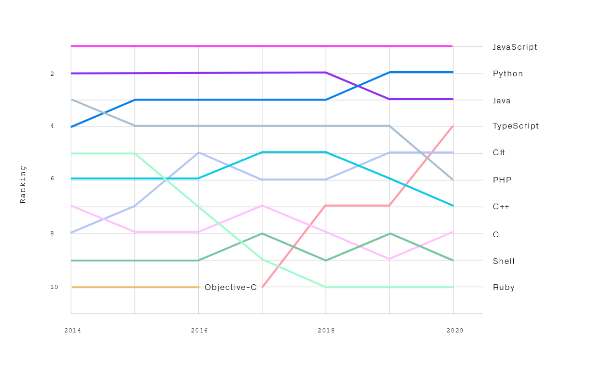
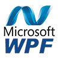
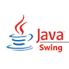
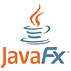
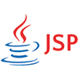
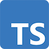

# Ecosystems

*  🔖 **Trending**
*  🔖 **Propriétaire**
*  🔖 **Open Source**

La construction des interfaces utilisateurs peut se faire via différents technologies, observons et différencions-les.

___

## 📑 Langages

Sur la base du trendings des langages, nous allons observer les technologies de ceux qui dominent le marché et définir d'autres pour les observer plus en détail par la suite.

___

## 📑 Propriétaire

Observons les technologies des acteurs majeurs, Microsft et Oracle

> **Microsoft** propose le langage **C#** et le Framework .NET permettant de développer des clients legers ou lourds.

* **Windows Forms** est le nom de l'interface graphique qui est incluse dans le framework .NET. En 2006 il est prévu qu'il soit remplacé par les WPF.

* **Windows Presentation Foundation** est la spécification graphique de Microsoft .NET 3.0. Il intègre le langage descriptif XAML qui permet de l'utiliser d'une manière proche d'une page HTML.

* ASP.NET est un framework permettant de générer à la demande des pages web, lancé par Microsoft en juillet 2002, et utilisé pour mettre en œuvre des applications web. Il s'agit d'une évolution majeure d'**Active Server Pages**.

> **Oracle** propose le langage **Java** et différentes technologies permettant de développer des clients legers ou lourds.

* **Swing** est une bibliothèque graphique pour le langage de programmation Java, faisant partie du package Java Foundation Classes, inclus dans J2SE. Swing constitue l'une des principales évolutions apportées par Java 2

* **JavaFX** est un framework et une bibliothèque d'interface utilisateur issue du projet OpenJFX. Cette bibliothèque a été conçue pour remplacer Swing mais depuis la version 11 de Java, Oracle n'est plus responsable de son développement.

* **JavaServer Faces** est un framework Java, pour le développement d'applications Web. À l'inverse des autres frameworks MVC traditionnels à base d'actions, JSF est basé sur la notion de composants

* Les **Java Server Pages** ou JSP est une technique basée sur Java qui permet aux développeurs de créer dynamiquement du code HTML, XML ou tout autre type de page web. Cette technique permet au code Java et à certaines actions prédéfinies d’être ajoutés dans un contenu statique.

___

## 📑 Open Source

Observons les langages majeurs de l'Open SOurce pour la construction d'interfaces utilisateur.

* **JavaScript** est un langage de programmation de scripts principalement employé dans les pages web interactives et à ce titre est une partie essentielle des applications web.

* **TypeScript** est un langage de programmation libre et open source développé par Microsoft qui a pour but d'améliorer et de sécuriser la production de code JavaScript. Il s'agit d'un sur-ensemble syntaxique strict de JavaScript.

> L'écoystème de JavaScript est très riche, il sera développé dans les prochaines sections.